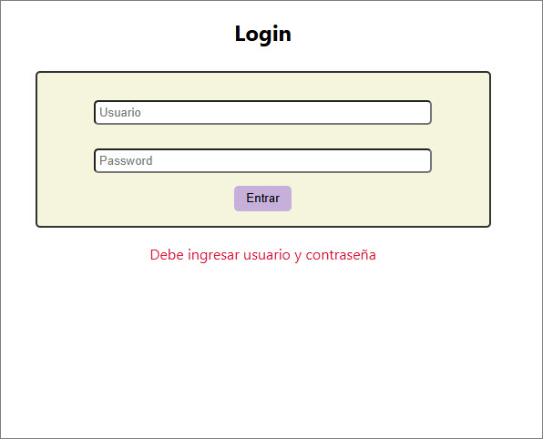
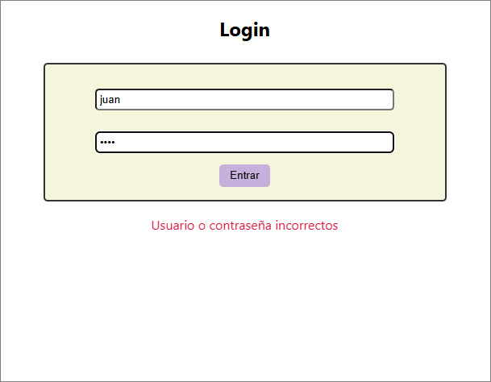
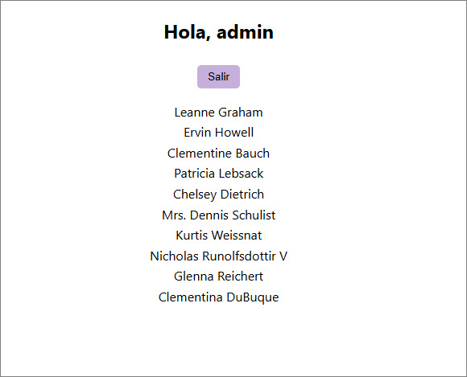

# gestion-estado
Ejercicio3 - Módulo VII - Vue

ejercicio desplegado: https://ramirezjm.github.io/gestion-estado/

[](https://choosealicense.com/licenses/mit/)


Mini-app con login y un dashboard que lista datos desde la API `jsonplaceholder.typicode.com`, adaptando los requerimientos originales de Vuex a Pinia, el estándar actual de gestión de estado para Vue 3, además de Vue Router para proteger rutas.

### Rutas
Contiene una ruta /login (pública) y /dashboard (privada con meta.requiresAuth: true). El usuario para testing es `admin` y la password `1234`. Si se intenta acceder a dashboard sin sesión, redirige a login.

```Javascript
const routes = [

  {
    path: "/login",
    component: AppLogin
  },

  {
    path: "/dashboard",
    component: UserDashboard,
    meta: { requiresAuth: true }
  },

  {
    path: "/",
    redirect: "/login"
  }

]
```

<div>
  
  
</div>

### Dashboard
Al acceder con el usuario correcto se ingresa a un dashbooard con un saludo, y se despliega una lista de usuarios desde la API


<div>
  
</div>

### Explicación de cambios
1. Asincronía en Actions

Las operaciones asincrónicas (como llamadas a API o simulación de login) se realizan dentro de las actions del store. En login:
```Javascript
async doLogin()
```
En la arquitectura original de Vuex, las mutations debían ser estrictamente sincrónicas, ya que Vuex necesitaba rastrear cambios de estado para el debugging y devtools. Pinia simplifica esta estructura eliminando las mutations y permitiendo modificar el estado directamente dentro de las actions.

2. Mutations sincrónicas (Vuex)

En Vuex, las mutations tenían la responsabilidad exclusiva de modificar el estado, y debían ser sincrónicas, porque el sistema de registro de cambios (time-travel debugging) requiere que las modificaciones ocurran de forma predecible. Por eso la asincronía se ubicaba en actions, que luego llamaban a mutations. En Pinia esta separación ya no es necesaria.

3. Protección de rutas con Router Guard

El acceso al dashboard está protegido mediante un global navigation guard del router.
```Javascript
router.beforeEach((to) => {
  const authStore = useAuthStore()
  if (to.meta.requiresAuth && !authStore.isAuthenticated) {
    return "/login"
  }
})
```
El funcionamiento es el siguiente:
- cada navegación pasa por beforeEach
- se revisa si la ruta tiene:
```Javascript
meta.requiresAuth = true
```
- si el usuario no está autenticado, se redirige automáticamente al login.
Esto evita que un usuario acceda directamente a rutas protegidas escribiendo la URL manualmente.

4. Adaptaciones de Vuex a Pinia

- Eliminación de mutations: Las mutations ya no son necesarias porque el estado puede modificarse directamente dentro de las actions.
- Conversión de módulos a stores: Cada store es equivalente a un módulo.
- Namespacing automático: En Pinia cada store ya está automáticamente aislado mediante su identificador.

### Clonar el repositorio

  ```bash
   git clone https://github.com/RamirezJM/gestion-estado.git
   cd gestion-estado
  ```

### Instalar dependencias

```bash
npm install
```

### Levantar el servidor

```bash
npm run dev
```
